[](https://dev.to/thuongtruong1009)
[](https://github.com/thuongtruong1009/e-shopee)
[](mailto:ititiu19228@student.hcmiu.edu.vn)


<div align="center">
  <h1> e-shopee</h1>
</div>

## Preview

- [Official demo link](https://e-shopee.vercel.app)
- [Dev beta link](https://www.shopest.tk)
- [API documents](https://tpo-project.github.io/e-commerce-api/#/) - [Backend repo](https://github.com/tpo-project/e-commerce-api)

<table>
  <tr>
    <td align="center">
      <details open><summary>e-shopee Index page</summary>
        
      </details>
      <details open><summary>Buyer Contact page</summary>
        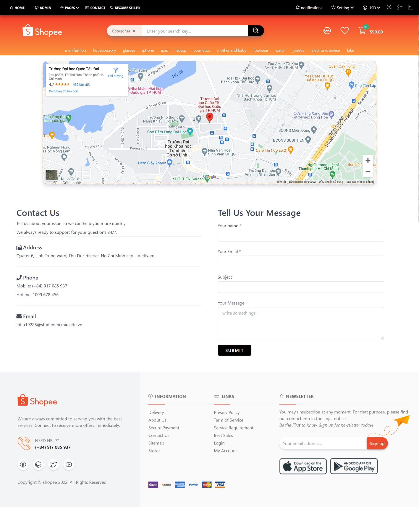
      </details>
      <details open><summary>Buyer About page</summary>
        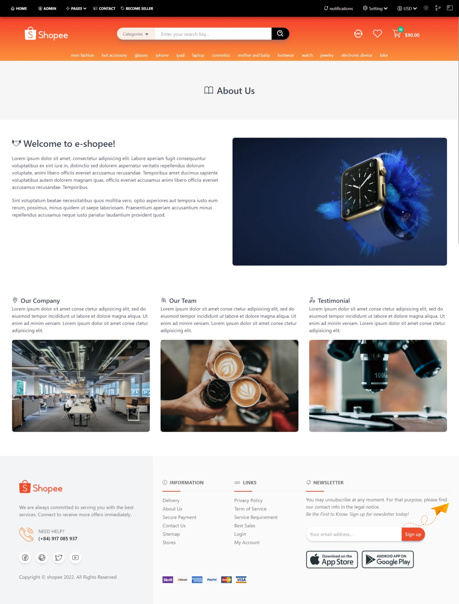
      </details>
      <details open><summary>Buyer Checkout page</summary>
        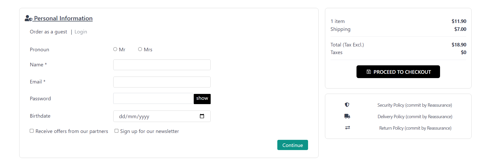
        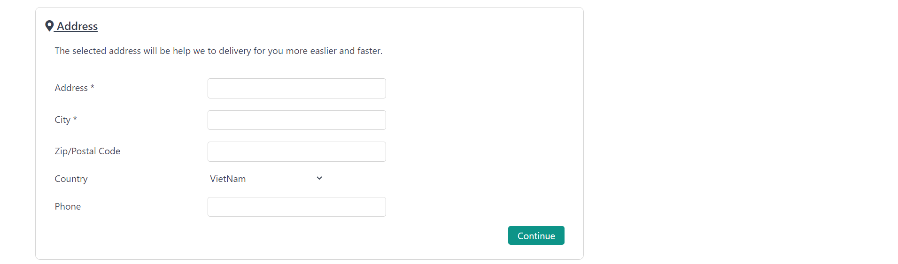
        
      </details>
      <details open><summary>Buyer Cart page</summary>
        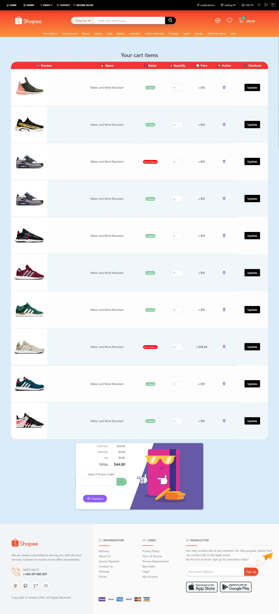
      </details>
      <details open><summary>Buyer Account page</summary>
        
        
        
        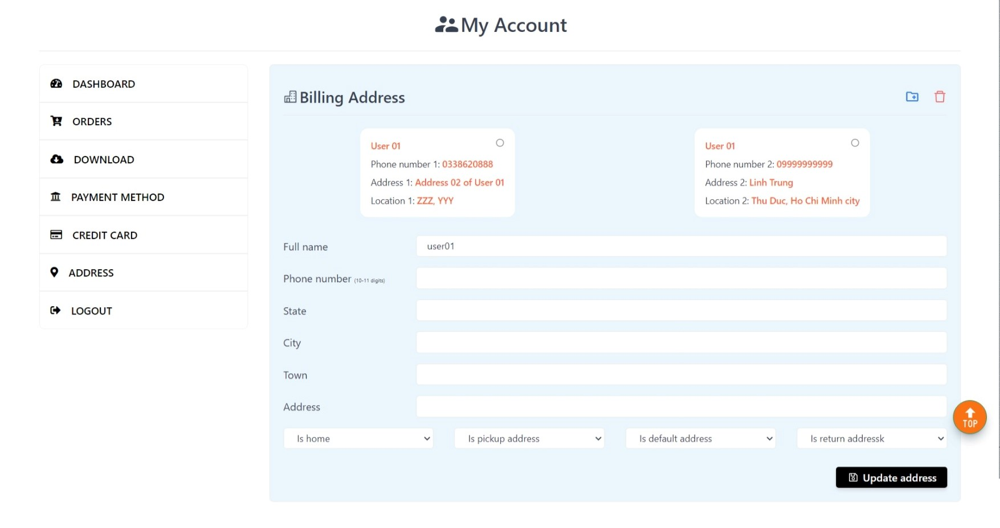
        
      </details>
      
    </td>
    <td align="center">
      <details open><summary>Buyer Register page</summary>
        
      </details>
      <details open><summary>Buyer Login page</summary>
        
      </details>
      <details open><summary>Buyer Home page</summary>
        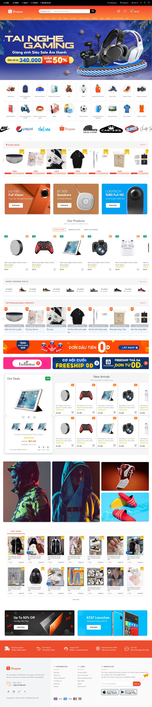
      </details>
      <details open><summary>Buyer Filter page</summary>
        
        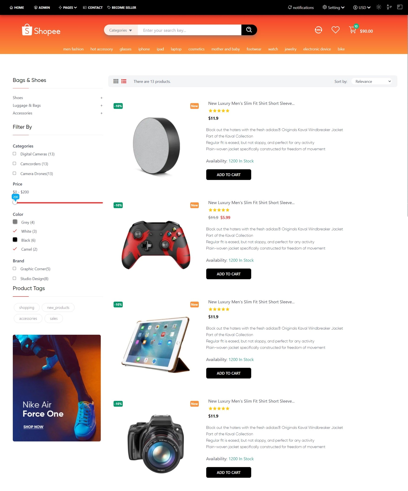
      </details>
      <details open><summary>Buyer Product details page</summary>
        
      </details>
      <details open><summary>Buyer Sidebar Menu page</summary>
        
      </details>
      <details open><summary>Author page</summary>
        
      </details>
      
    </td>
  </tr>
  <tr>
    <td align="center">
     <details open><summary>Seller dashboard page</summary>
        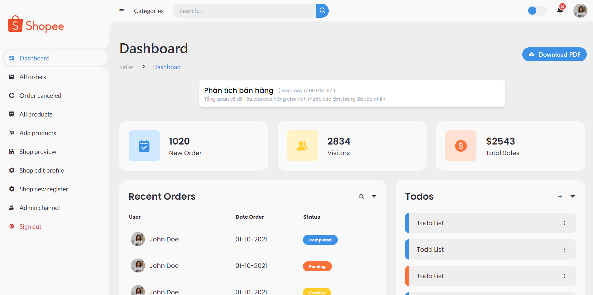
      </details>
      <details open><summary>Seller orders page</summary>
        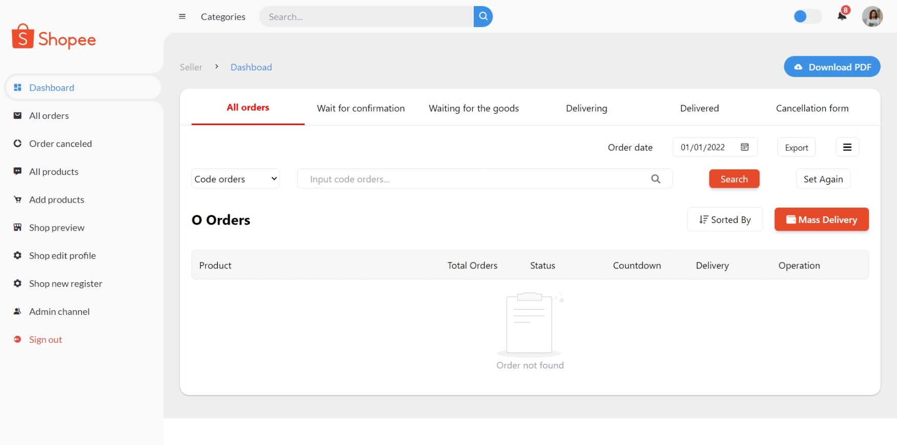
      </details>
      <details open><summary>Seller add products page</summary>
        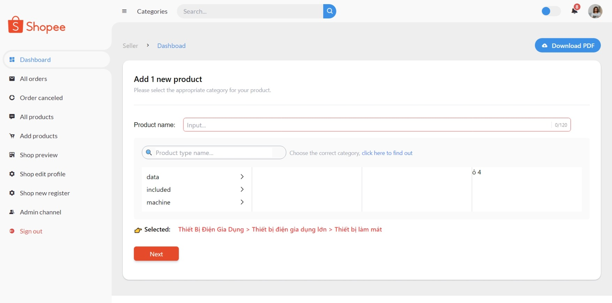
      </details>
      <details open><summary>Seller all products page</summary>
        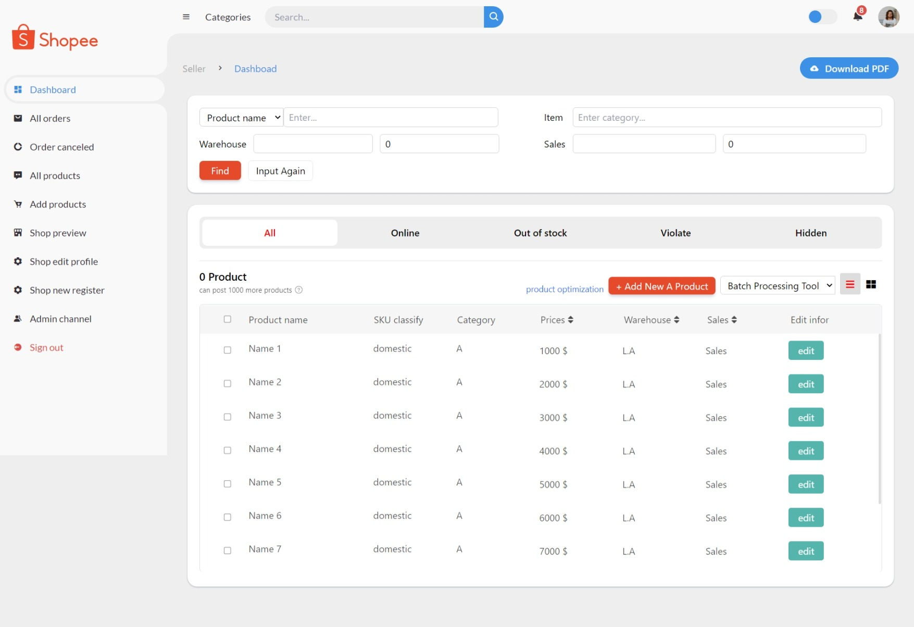
      </details>
      <details open><summary>Seller notifications page</summary>
        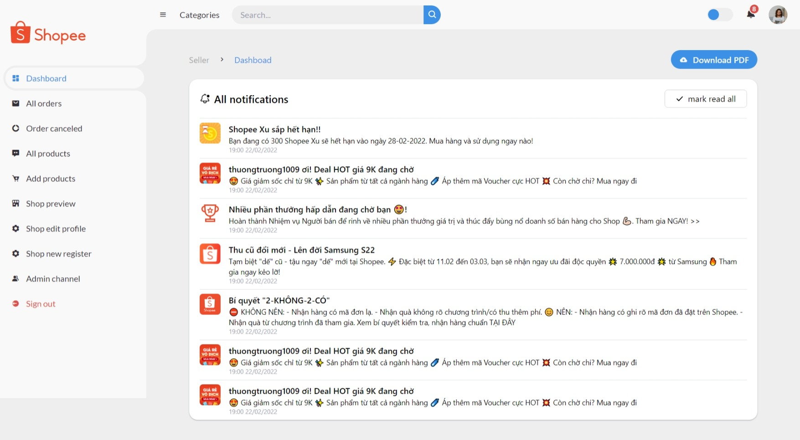
      </details>
      
    </td>
    <td align="center">
      <details open><summary>Seller shop register page</summary>
        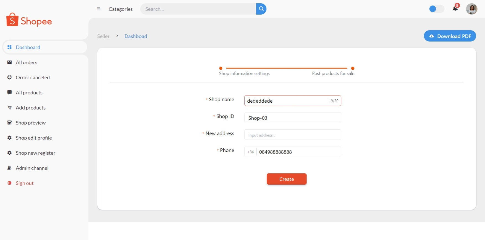
      </details>
      <details open><summary>Seller shop profile page</summary>
        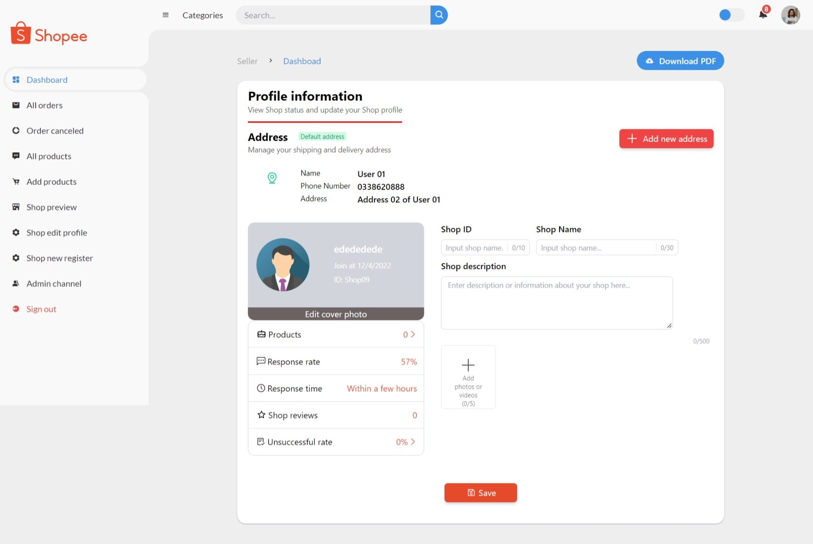
      </details>
      <details open><summary>Seller shop preview page</summary>
        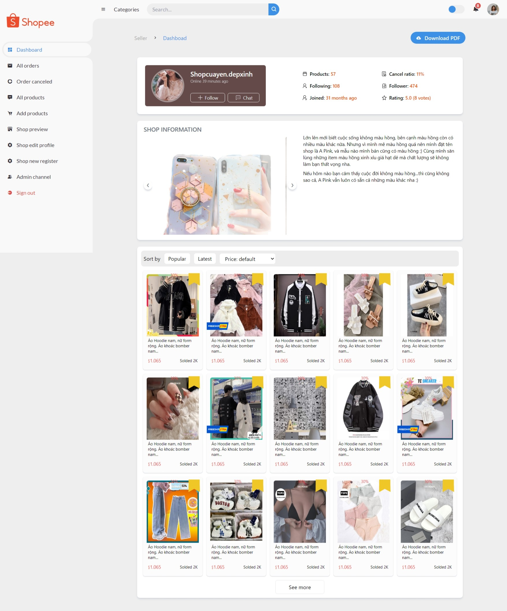
      </details>
      
    </td>
  </tr>
  <tr>
    <td align="center">
      <details open><summary>Admin login page</summary>
        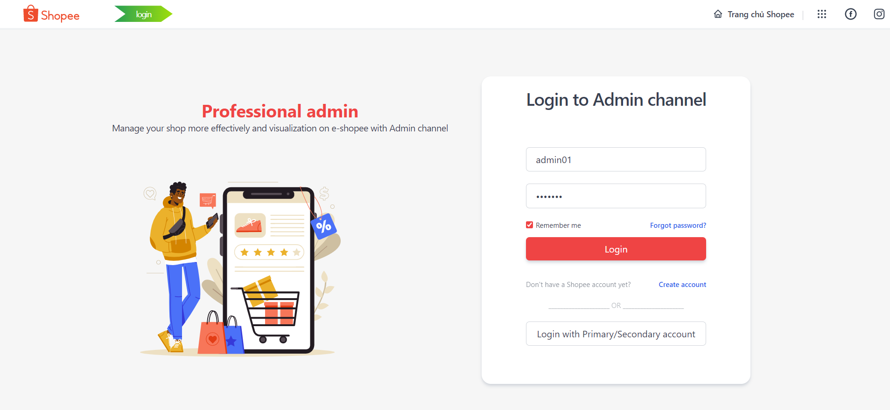
      </details>
      
    </td>
     <td align="center">
      <details open><summary>Admin dashboard page</summary>
        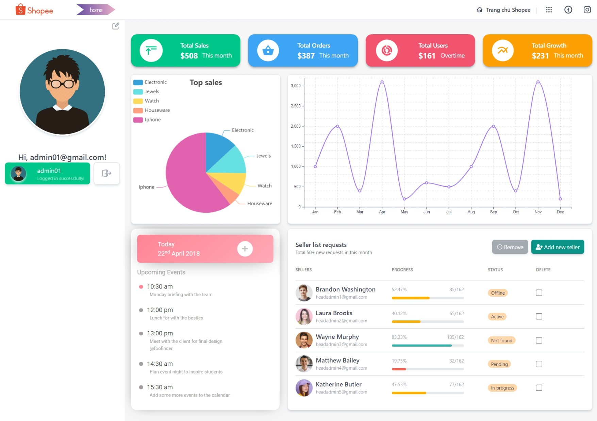
      </details>
      
    </td>
  </tr>
</table>

## Descriptions and requirements
* Authenticate multi users
* **3-roles** interface (Buyer-Seller-Admin). Reference with [shopee website](https://shopee.vn)
* Connect databases and **API** by **Axios** request
* Multi language locales web (VietNamese, English, Russian, Chinese, Indian, Korean, Japanese, Spanish, Brazil, France...)
* Dark/Light modes web
* Friendly with **SEO** and **Google Analys**
* Auto reponsive on all media sizes
* Site map diagram
* Deploying online to server by [Vercel](https://vercel.com)

## Feature
- 🧩 [slick](https://antoniandre.github.io/vueper-slides/?ref=madewithvuejs.com)

- 🧮 [carousel](https://ismail9k.github.io/vue3-carousel/getting-started.html)

- 🎃 [icon](https://icon-sets.iconify.design/)

- 📈 [Pie-chart](https://www.npmjs.com/package/vue-echarts) - [example](https://codesandbox.io/s/2y6m6?file=/src/App.vue)

- 🚧 [Area chart](https://www.vuescript.com/svg-based-charting-library/) - [docs](https://vue3charts.org/docs/getting-started)

- 🔗 [Admin template 1](https://adminlte.io/themes/v3/#) - [Admin template 2](https://technext.github.io/star-admin2-free-admin-template/#)

- ✨ [template idea 1](https://www.oberlo.com/blog/ecommerce-website-design-examples) - [template idea 2](https://shopee.vn/web)

- ⚡️ [Vue 3](https://github.com/vuejs/vue-next), [Vite 2](https://github.com/vitejs/vite), [pnpm](https://pnpm.js.org/), [ESBuild](https://github.com/evanw/esbuild) - born with fastness

- 🗂 [File based routing](./src/pages)

- 📦 [Components auto importing](./src/components)

- 🍍 [State Management via Pinia](https://pinia.esm.dev/)

- 📑 [Layout system](./src/layouts)

- 📲 [PWA](https://github.com/antfu/vite-plugin-pwa)

- 🎨 [Windi CSS](https://github.com/windicss/windicss) - next generation utility-first CSS framework

- 😃 [Use icons from any icon sets, with no compromise](https://github.com/antfu/unplugin-icons)

- 🌍 [I18n ready](./locales)

- 🗒 [Markdown Support](https://github.com/antfu/vite-plugin-md)

- 🔥 Use the [new `<script setup>` syntax](https://github.com/vuejs/rfcs/pull/227)

- 📥 [APIs auto importing](https://github.com/antfu/unplugin-auto-import) - use Composition API and others directly

- 🖨 Server-side generation (SSG) via [vite-ssg](https://github.com/antfu/vite-ssg)

- 🦔 Critical CSS via [critters](https://github.com/GoogleChromeLabs/critters)

- 🦾 TypeScript, of course

- ⚙️ Unit Testing with [Vitest](https://github.com/vitest-dev/vitest), E2E Testing with [Cypress](https://cypress.io/) on [GitHub Actions](https://github.com/features/actions)

- ☁️ Deploy on Netlify, zero-config

<br>

### UI Frameworks

- [Windi CSS](https://github.com/windicss/windicss) (On-demand [TailwindCSS](https://tailwindcss.com/)) - lighter and faster, with a bunch of additional features!

### Plugins

- [Vue Router](https://github.com/vuejs/vue-router)
- [`vite-plugin-pages`](https://github.com/hannoeru/vite-plugin-pages) - file system based routing
- [`vite-plugin-vue-layouts`](https://github.com/JohnCampionJr/vite-plugin-vue-layouts) - layouts for pages
- [Pinia](https://pinia.esm.dev) - Intuitive, type safe, light and flexible Store for Vue using the composition api
- [`unplugin-vue-components`](https://github.com/antfu/unplugin-vue-components) - components auto import
- [`unplugin-auto-import`](https://github.com/antfu/unplugin-auto-import) - Directly use Vue Composition API and others without importing
- [`vite-plugin-pwa`](https://github.com/antfu/vite-plugin-pwa) - PWA
- [`vite-plugin-windicss`](https://github.com/antfu/vite-plugin-windicss) - Windi CSS Integration
- [`vite-plugin-md`](https://github.com/antfu/vite-plugin-md) - Markdown as components / components in Markdown
- [`markdown-it-prism`](https://github.com/jGleitz/markdown-it-prism) - [Prism](https://prismjs.com/) for syntax highlighting
- [`prism-theme-vars`](https://github.com/antfu/prism-theme-vars) - customizable Prism.js theme using CSS variables
- [Vue I18n](https://github.com/intlify/vue-i18n-next) - Internationalization
- [`vite-plugin-vue-i18n`](https://github.com/intlify/vite-plugin-vue-i18n) - Vite plugin for Vue I18n
- [VueUse](https://github.com/antfu/vueuse) - collection of useful composition APIs
- [`@vueuse/head`](https://github.com/vueuse/head) - manipulate document head reactively

### Coding Style

- Use Composition API with [`<script setup>` SFC syntax](https://github.com/vuejs/rfcs/pull/227)
- [ESLint](https://eslint.org/) with [@antfu/eslint-config](https://github.com/antfu/eslint-config), single quotes, no semi.

### Dev tools

- [TypeScript](https://www.typescriptlang.org/)
- [Vitest](https://github.com/vitest-dev/vitest) - Unit testing powered by Vite
- [Cypress](https://cypress.io/) - E2E testing
- [pnpm](https://pnpm.js.org/) - fast, disk space efficient package manager
- [`vite-ssg`](https://github.com/antfu/vite-ssg) - Server-side generation
- [critters](https://github.com/GoogleChromeLabs/critters) - Critical CSS
- [Netlify](https://www.netlify.com/) - zero-config deployment
- [VS Code Extensions](./.vscode/extensions.json)
- [Vite](https://marketplace.visualstudio.com/items?itemName=antfu.vite) - Fire up Vite server automatically
- [Volar](https://marketplace.visualstudio.com/items?itemName=johnsoncodehk.volar) - Vue 3 `<script setup>` IDE support
- [Iconify IntelliSense](https://marketplace.visualstudio.com/items?itemName=antfu.iconify) - Icon inline display and autocomplete
- [i18n Ally](https://marketplace.visualstudio.com/items?itemName=lokalise.i18n-ally) - All in one i18n support
- [Windi CSS Intellisense](https://marketplace.visualstudio.com/items?itemName=voorjaar.windicss-intellisense) - IDE support for Windi CSS
- [ESLint](https://marketplace.visualstudio.com/items?itemName=dbaeumer.vscode-eslint)
- [Docker](https://viblo.asia/p/vuejs-huong-dan-deploy-vuejs-bang-docker-gAm5yDGOldb) - [ENV](https://viblo.asia/p/vuejs-trong-docker-nhu-the-nao-oOVlYpmQZ8W)

## Try it now!

> Vitesse requires Node >=14

> [Allow CORS extension](https://chrome.google.com/webstore/detail/allow-cors-access-control/lhobafahddgcelffkeicbaginigeejlf)

### GitHub Template

[Create a repo from this template on GitHub](https://github.com/thuongtruong1009/e-shopee/generate).

### Clone to local
```bash
git clone https://github.com/thuongtruong1009/e-shopee
cd e-shopee
pnpm i # If you don't have pnpm installed, run: npm install -g pnpm
```

## Checklist
When you use this template, try follow the checklist to update your info properly
- [ ] Change the author name in `LICENSE`
- [ ] Change the title in `App.vue`
- [ ] Change the favicon in `public`
- [ ] Remove the `.github/FUNDING` file which contains the funding info
- [ ] Clean up the READMEs and remove routes

And, enjoy :)

## Usage
#### Development
- Just run and auto open at http://localhost:3333
```bash
pnpm dev
```
#### Build
- To build the App, run
```bash
pnpm build
```
#### Test
```bash
pnpm test
```
#### Preview your production
```bash
pnpm preview
```

### Deploy on Netlify
- Go to [Netlify](https://app.netlify.com/start) and select your clone, `OK` along the way, and your App will be live in a minute.

## Reference
- Relax with [bee-music](https://github.com/thuongtruong1009/bee-music)
- Enhance front-end skills through [twitter-meta](https://github.com/thuongtruong1009/twitter-meta)
- Generate your GitHub informations by [gitbox](https://github.com/thuongtruong1009/gitbox)
- Begining Vue through [notedev](https://github.com/thuongtruong1009/notedev)
- Learning front-end web full course at [frontend-master](https://github.com/thuongtruong1009/frontend-master)
- Learn Object-Oriented-Programming tutorial at [Snake-Game-OOP](https://github.com/thuongtruong1009/Snake-Game-OOP)
- Become Java master for new beginner at [Java-training](https://github.com/thuongtruong1009/java-oop-training)
- Pratice UI/UX at [league-fo-legend](https://github.com/thuongtruong1009/league-of-legends-clone)
- Make flip card game at [flip-card](https://github.com/thuongtruong1009/flip-cards)
- Learn computer architecture at [computer-architecture](https://github.com/thuongtruong1009/computer-architecture)

## ❤️ [Support me](https://www.paypal.me/thuongtruong1009)

> We are looking for sponsors to join us to have better community reach and impact.

[](https://nhantien.momo.vn/0917085937)
<a href="https://www.paypal.me/thuongtruong1009">

</a>
<a href='https://ko-fi.com/thuongtruong1009' target='_blank'>

</a>

## 📰 [License](LICENSE)

- ##### This project is distributed under the [MIT License](LICENSE).
- ##### Copyright of [@thuongtruong1009](https://github.com/thuongtruong1009), 2022.
